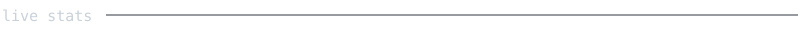
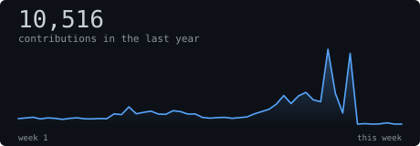
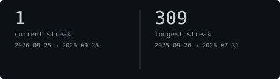
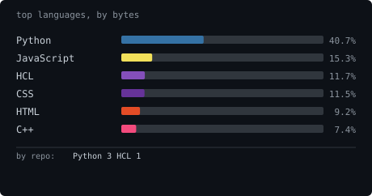
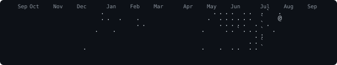

  

  

<h1 align="left">Hello. I am Bhuvanesh. A highschool student and developer</h1>

I like turning interesting ideas into working software and hardware.

Right now, I'm building a [chess engine](https://github.com/BhuvaneshN09/Chess-Engine)
and improving [Binlytic](https://github.com/BhuvaneshN09/BinlyticAI), an
AI-powered waste-sorting assistant.

If you have any questions about my work or would like to collaborate with me, reach out to
[my email](mailto:bhuvanallapati@gmail.com).

### what i'm building

<table>
  <tr>
    <td width="50%" valign="top">
      <h3><a href="https://github.com/BhuvaneshN09/Chess-Engine">Chess Engine</a></h3>
      
A chess engine with position evaluation, alpha-beta search, and UCI support.

    </td>
    <td width="50%" valign="top">
      <h3><a href="https://github.com/BhuvaneshN09/BInlyticAI">Binlytic</a></h3>
      
A webcam assistant that classifies waste as recycling, compost, garbage, or unknown.

    </td>
  </tr>
</table>

### tools i use

  
  

  

   
   
   
  

  

- feel free to look through my projects!
